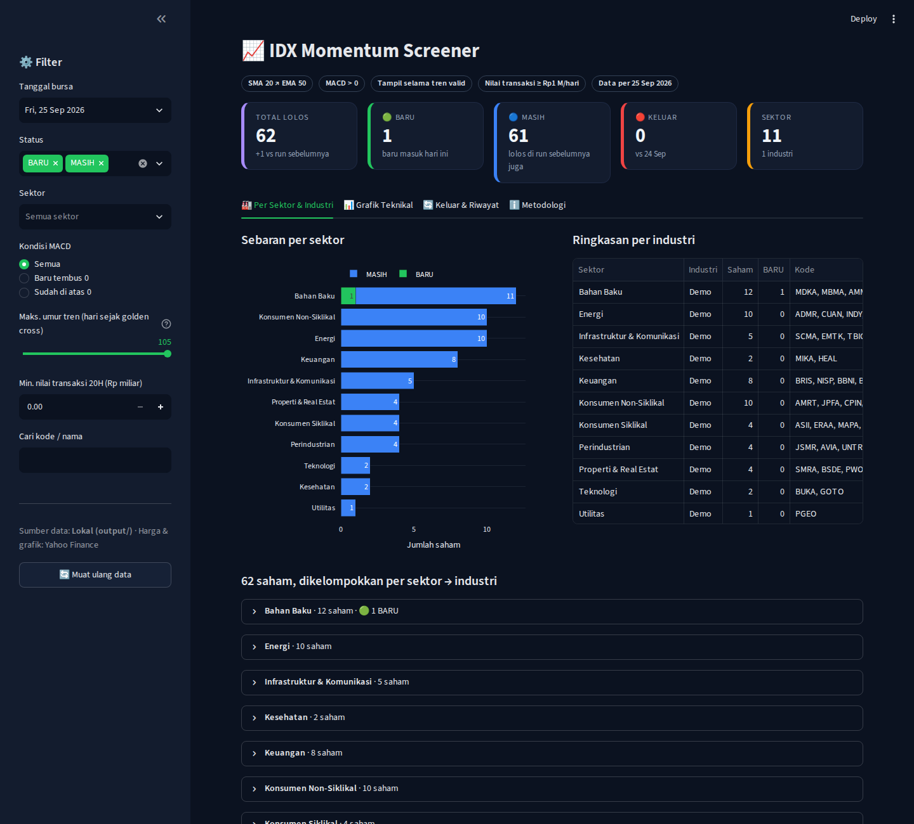

# 📈 IDX Momentum Screener — SMA20 × EMA50 + MACD

Screener harian untuk **seluruh saham Bursa Efek Indonesia** yang dijalankan otomatis oleh
**GitHub Actions**, menyimpan hasil ke **Supabase**, dan ditampilkan di **dashboard Streamlit**
dengan data harga dari **Yahoo Finance**.



---

## 1. Ide & Tujuan

Menangkap saham yang **baru memasuki fase momentum naik**:

| # | Kriteria | Definisi teknis |
|---|----------|-----------------|
| 1 | **Golden cross** (entry) | SMA 20 memotong ke atas EMA 50 |
| 2 | **Konfirmasi MACD** (entry) | Garis MACD (12, 26, 9) **> 0** dalam **5 hari bursa** sejak golden cross — baru menembus garis nol (`CROSS_UP_0`) atau sudah di atasnya (`ABOVE_0`) |
| 3 | **Bertahan** | Setelah entry, saham **tetap tampil tanpa batas hari** selama SMA 20 > EMA 50 **dan** MACD tidak pernah turun ke bawah 0 |
| 4 | **Likuiditas** | Rata-rata nilai transaksi 20 hari ≥ **Rp1 miliar** dan harga ≥ Rp50 (dicek setiap hari) |

**Pengurutan hasil:** Sektor → Industri → BARU dulu → nilai transaksi terbesar.

**Status di dashboard** (dibanding run sukses sebelumnya):

- 🟢 **BARU** — lolos hari ini, tidak lolos kemarin
- 🔵 **MASIH** — lolos hari ini dan kemarin (+ *streak* = jumlah hari berturut-turut)
- 🔴 **KELUAR** — lolos kemarin, tidak lolos hari ini

> Saham **KELUAR** hanya jika SMA 20 turun ke bawah EMA 50, MACD turun ke bawah 0, atau likuiditas
> di bawah batas. Saham yang sudah keluar baru bisa masuk lagi lewat golden cross berikutnya.
> Kolom *Umur tren* (hari sejak golden cross) dan slider di dashboard membantu memisahkan setup
> segar dari tren yang sudah berjalan lama.
>
> Aturan ini dihitung **stateless dari histori harga** (`trend_entry()` di `signals.py`), jadi
> run pertama langsung menampilkan semua tren yang masih valid, dan run yang terlewat tidak merusak
> daftar. Status BARU/MASIH tetap dibandingkan dengan run sebelumnya.

---

## 2. Arsitektur

```
             ┌────────────── GitHub Actions ──────────────┐
             │                                            │
 Sabtu 08:00 │  weekly_universe.yml                       │
   WIB       │   └─ build_universe.py                     │
             │       Yahoo screener (exchange=JKT) ──┐    │
             │       Ticker.info → sektor/industri   │    │
             │       data/sector_override.csv (IDX-IC)    │
             │                                       ▼    │
 Sen–Jum     │  daily_screener.yml               ┌──────────────┐
 18:05 WIB   │   ├─ pytest                       │   SUPABASE   │
             │   └─ run_screener.py  ──────────▶ │  stocks      │
             │       1. universe  ◀───────────── │  screening_  │
             │       2. yf.download (batch 80)   │    runs      │
             │       3. SMA/EMA/MACD + kriteria  │  screening_  │
             │       4. BARU/MASIH vs run lalu ◀─│    results   │
             │       5. upsert                   └──────┬───────┘
             └────────────────────────────────────────  │ (anon key, read-only / RLS)
                                                        ▼
                                   ┌────────────── Streamlit Cloud ─────────────┐
                                   │  KPI · Per Sektor & Industri · Grafik      │
                                   │  Teknikal (candlestick + SMA/EMA + MACD    │
                                   │  live dari Yahoo) · Keluar & Riwayat       │
                                   └────────────────────────────────────────────┘
```

**Keputusan desain penting**

- **Tanggal run = tanggal bar terakhir di data Yahoo**, bukan tanggal jam dinding. Jadi hari libur
  bursa otomatis terdeteksi (tanggalnya sudah ada di `screening_runs` → job dilewati). Idempoten:
  aman dijalankan ulang.
- **Saham suspensi / tanpa transaksi** (bar terakhir ≠ tanggal bursa) dikecualikan.
- **Indikator dihitung sendiri dengan pandas** (EMA `adjust=False`, sama dengan TradingView/Stockbit),
  tanpa TA-Lib → instalasi ringan di GitHub runner.
- **Service role key hanya di GitHub Secrets**; dashboard memakai anon key yang dibatasi RLS ke `SELECT`.
- Dashboard **menghitung ulang indikator** dari harga Yahoo terbaru untuk grafik, jadi grafik selalu
  konsisten dengan logika screener (fungsi yang sama: `screener/signals.py`).

---

## 3. Struktur repo

```
.
├── .github/workflows/
│   ├── daily_screener.yml      # Sen–Jum 11:05 UTC (18:05 WIB) + manual
│   └── weekly_universe.yml     # Sabtu 01:00 UTC + manual
├── screener/
│   ├── config.py               # parameter (bisa di-override env var)
│   ├── indicators.py           # SMA, EMA, MACD
│   ├── signals.py              # kriteria, BARU/MASIH, pengurutan
│   ├── data.py                 # download Yahoo batch + retry
│   ├── db.py                   # helper Supabase
│   ├── build_universe.py       # daftar emiten + sektor/industri
│   └── run_screener.py         # job harian
├── app/
│   ├── streamlit_app.py        # dashboard
│   ├── charts.py               # grafik Plotly
│   └── data_source.py          # Supabase / mode lokal + harga Yahoo
├── supabase/schema.sql         # tabel, index, RLS, view
├── data/
│   ├── universe_seed.csv       # cadangan bila Yahoo screener gagal
│   └── sector_override.example.csv
├── tests/test_signals.py
├── requirements.txt            # dashboard (Streamlit Cloud)
└── requirements-screener.txt   # GitHub Actions
```

---

## 4. Skema data (Supabase)

| Tabel | Isi | Kunci |
|-------|-----|-------|
| `stocks` | ticker, nama, sektor, industri, aktif | `ticker` |
| `screening_runs` | 1 baris per tanggal bursa: status, jumlah universe, likuid, lolos, baru, keluar | `run_date` |
| `screening_results` | saham yang lolos + metrik (close, SMA20, EMA50, spread, MACD, tgl cross, streak, nilai transaksi, status) | `(run_date, ticker)` |
| `v_latest_results` | view hasil run sukses terakhir | — |

---

## 5. Setup (± 20 menit)

### a. Supabase
1. Buat project di [supabase.com](https://supabase.com) (free tier cukup).
2. **SQL Editor** → tempel & jalankan `supabase/schema.sql`.
3. **Project Settings → API**: catat `Project URL`, `anon key`, `service_role key`.

### b. GitHub
1. Push repo ini ke GitHub.
2. **Settings → Secrets and variables → Actions → Secrets**:
   - `SUPABASE_URL`
   - `SUPABASE_SERVICE_ROLE_KEY`
3. (Opsional) **Variables**: `MIN_AVG_VALUE_IDR`, `CROSS_LOOKBACK`.
4. **Actions → Weekly Universe Refresh → Run workflow** (centang *full*) — sekali di awal,
   ± 10–15 menit untuk ± 950 emiten.
5. **Actions → Daily IDX Screener → Run workflow** — cek tabel `screening_results` terisi.

### c. Streamlit Community Cloud
1. [share.streamlit.io](https://share.streamlit.io) → *New app* → pilih repo, main file
   `app/streamlit_app.py`.
2. **Advanced settings → Secrets**:
   ```toml
   SUPABASE_URL = "https://xxxx.supabase.co"
   SUPABASE_ANON_KEY = "eyJ..."
   ```

### d. Jalankan lokal (tanpa Supabase)
```bash
pip install -r requirements.txt -r requirements-screener.txt
python -m screener.build_universe --dry-run   # -> output/universe.csv
python -m screener.run_screener --dry-run     # -> output/results_YYYY-MM-DD.csv
streamlit run app/streamlit_app.py            # otomatis mode lokal bila secrets kosong
python -m pytest -q
```

---

## 6. Parameter (env var)

| Variabel | Default | Keterangan |
|----------|---------|------------|
| `SMA_PERIOD` / `EMA_PERIOD` | 20 / 50 | |
| `MACD_FAST` / `MACD_SLOW` / `MACD_SIGNAL` | 12 / 26 / 9 | |
| `CROSS_LOOKBACK` | 5 | jendela entry: MACD harus > 0 dalam N hari bursa sejak golden cross |
| `MIN_AVG_VALUE_IDR` | 1000000000 | min. rata-rata nilai transaksi 20 hari |
| `MIN_PRICE` | 50 | |
| `HISTORY_PERIOD` | 1y | data harga yang diunduh |
| `BATCH_SIZE` / `BATCH_PAUSE_SEC` | 80 / 2 | hindari rate-limit Yahoo |

---

## 7. Klasifikasi sektor & industri

Default memakai sektor/industri **Yahoo Finance** (label sektor diterjemahkan ke Bahasa Indonesia
di dashboard). Untuk memakai **IDX-IC** resmi, buat `data/sector_override.csv`:

```csv
ticker,sector,industry
BBCA,Keuangan,Bank
TLKM,Infrastruktur,Telekomunikasi
```
lalu jalankan *Weekly Universe Refresh*. Baris override selalu menimpa data Yahoo.

---

## 8. Catatan operasional & risiko

- **Yahoo Finance tidak resmi**: bisa rate-limit, data .JK kadang telat. Job sudah punya retry per
  batch; jika sebagian ticker gagal, hasil tetap tersimpan dan jumlahnya tercatat di `screening_runs`.
- **Cron GitHub bisa terlambat 5–30 menit** saat antrean ramai — normal.
- **Repo publik tanpa commit 60 hari** → GitHub menonaktifkan scheduled workflow. Cukup commit
  sesekali atau aktifkan ulang di tab Actions.
- **Supabase free tier** di-pause setelah 7 hari tanpa aktivitas — job harian menjaga tetap aktif.
- Data Yahoo harian .JK umumnya lengkap ± 1–2 jam setelah penutupan; jadwal 18:05 WIB memberi jeda aman.

## 9. Pengembangan berikutnya (opsional)

- Notifikasi Telegram/WhatsApp untuk daftar 🟢 BARU setiap sore.
- Kolom konfirmasi tambahan: volume > rata-rata 20 hari, RSI 50–70, harga di atas EMA 200.
- Backtest sederhana: return 5/10/20 hari setelah status BARU, per sektor.
- Watchlist pribadi & catatan per saham di Supabase.

---

*Bukan rekomendasi jual/beli. Gunakan sebagai alat bantu analisis.*
